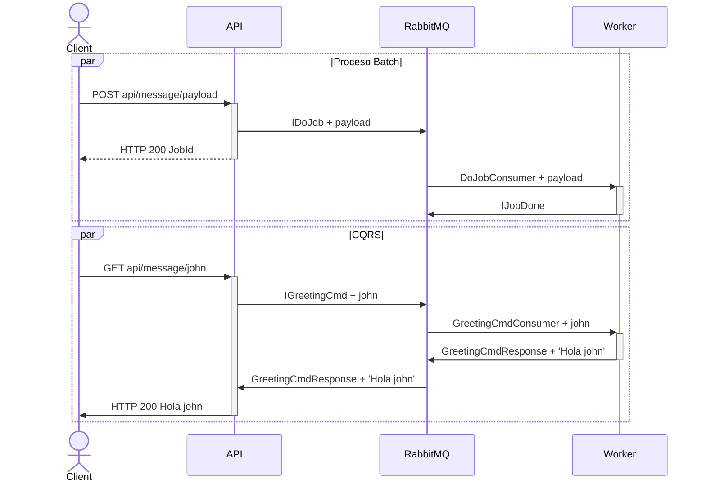

# UNAHUR Worker Service

```bash
dotnet publish -a win-x64
```


Este proyecto es una implementación simple de los patrones: [CQRS](https://learn.microsoft.com/en-us/azure/architecture/patterns/) y [arquitectura lambda](https://en.wikipedia.org/wiki/Lambda_architecture). A fin de proveer un ejemplo de base para ejercitar con una arquitectura de microservicios.

_ARQUITECTURA_


La funcionalidad se distribuye en tres componentes principales.

- **API**: recibe comando vía REST. Los encola en el bus de mensajes y envía la respuesta pertinente
  - `POST api/message/{data}`: Crea un proceso batch `IDoJob` a ser procesado por worker
  - `GET api/message/{name}`: Envía el comando `IGreetingCmd` para recibir una respuesta desde worker
- **Worker**: Procesa trabajos en segundo plano
  - `DoJobConsumer`: Procesa el proceso batch `IDoJob`.
  - `GreetingCmdConsumer`: Procesa el comando CQRS `IGreetingCmd`.
- **RabbitMQ**: bus de mensajes AMQP que conecta **API** y **Worker**

*DIAGRAMA DE SECUENCIA CON LOS DOS PROCESOS PRINCIPALES*



## Ejemplo

En la carpeta `./example` hay un ejemplo de implementación utilizando `docker-compose`

```bash
cd example
# DOCKER
docker-compose up -d
# NERDCTL
nerdctl compose up -d
```

**Limpieza**

```bash
# DOCKER
docker-compose stop
docker-compose rm
# NERDCTL
nerdctl compose stop
nerdctl compose rm
```

## Contenedor RabbitMQ

Broker de mensajes para la comunicación entre servicios. La imagen es una customización de la imagen oficial de [RabbitMQ en Docker Hub](https://hub.docker.com/_/rabbitmq/)

### Endpoints

| NOMBRE        | PUERTO | PATH       | DESCRIPCION                      |
| ------------- | ------ | ---------- | -------------------------------- |
| AMQP          | 5672   |            | Puerto TPC para bus de mensajes  |
| MANAGEMENT-UI | 15672  | `/`        | Interface HTML de administración |
| METRICAS      | 15692  | `/metrics` | Métricas en formato *Prometheus* |

### Configuración

La imagen de RabbitMQ tiene muchos parámetros de configuración. A fines prácticos estos son los dos parámetros utilizados en el ejemplo.

| ENV                     | DESCRIPCION                  |
| ----------------------- | ---------------------------- |
| `RABBITMQ_DEFAULT_USER` | Usuario default              |
| `RABBITMQ_DEFAULT_PASS` | Clave del usuario de default |

## Contenedor API

Recibe comando vía REST. Los encola en el bus de mensajes y envía la respuesta pertinente.

La imagen esta disponible en https://quay.io/repository/unahur.arqsw/messagefun.api
[](https://quay.io/repository/unahur.arqsw/messagefun.api)

### Endpoints API

| NOMBRE     | PUERTO | PATH             | DESCRIPCION                           |
| ---------- | ------ | ---------------- | ------------------------------------- |
| API        | 8080   | `/api`           | Apis REST                             |
| SWAGGER-UI | 8080   | `/swagger`       | Interface HTML de prueba (Swagger-UI) |
| METRICAS   | 8080   | `/metrics`       | Métricas en formato *Prometheus*      |
| HEALTH     | 8080   | `/healthz/live`  | Sonda de servicio VIVO                |
| READY      | 8080   | `/healthz/ready` | Sonda de servicio LISTO               |

### Configuración API

El sistema puede configurarse mediante un archivo `app\appsettings.json`) o variables de entorno

```json
{
  "MessageBusFun": {
    "RabbitMQ": {
      "Host": "rabbitmq://rabbitmq:5672",
      "Username": "desa",
      "Password": "desarrollo"
    }
  }
}
```

| PATH                              | ENV                                | DESCRIPCION                      |
| --------------------------------- | ---------------------------------- | -------------------------------- |
| `MessageBusFun.RabbitMQ.Host`     | `MessageBusFun__RabbitMQ__Host`    | URI de Rabbit MQ                 |
| `MessageBusFun.RabbitMQ.Username` | MessageBusFun__RabbitMQ__Username` | Nombre de usuario de RabbitMQ    |
| `MessageBusFun.RabbitMQ.Password` | MessageBusFun__RabbitMQ__Password` | Password del usuario de RabbitMQ |

## Contenedor Worker

Procesa trabajos en segundo plano
La imagen esta disponible en https://quay.io/repository/unahur.arqsw/messagefun.worker
[](https://quay.io/repository/unahur.arqsw/messagefun.worker)

### Endpoints Worker

| NOMBRE   | PUERTO | PATH             | DESCRIPCION                      |
| -------- | ------ | ---------------- | -------------------------------- |
| METRICAS | 9090   | `/metrics`       | Métricas en formato *Prometheus* |
| HEALTH   | 9090   | `/healthz/live`  | Sonda de servicio VIVO           |
| READY    | 9090   | `/healthz/ready` | Sonda de servicio LISTO          |

### Configuración Worker

IDEM API

## DEBUG

Para hacer un *debug* puede utilizar la instancia de RabbitMQ del ejemplo con `docker-compose` ó crear una instancia dedicada (como usan los mismos puertos debe elegir una de las dos opciones NO ambas)

**Herramientas**

- [Visual Studio 2022 Community](https://visualstudio.microsoft.com/es/vs/community/)
- Rancher Desktop
- Instancia de Rabbit

Para crear una instancia de RabbitMQ independiente puede utilizar el siguiente comando

```bash
# DOCKER
docker run -d --hostname myrabbit --name rabbitmq -p 15672:15672 -p 5672:5672 -e RABBITMQ_DEFAULT_USER=desa -e RABBITMQ_DEFAULT_PASS=desarrollo masstransit/rabbitmq:latest
# NERDCRL
nerdctl run -d --hostname myrabbit --name rabbitmq -p 15672:15672 -p 5672:5672 -e RABBITMQ_DEFAULT_USER=desa -e RABBITMQ_DEFAULT_PASS=desarrollo masstransit/rabbitmq:latest
```

**Limpieza** Para eliminar el contenedor creado

```bash
# DOCKER
docker stop myrabbit
docker rm myrabbit

# NERDCTL
nerdctl stop myrabbit
nerdctl rm myrabbit
```

## Open Telemetry

[Monitoring a .NET application using OpenTelemetry - Meziantou's blog](https://www.meziantou.net/monitoring-a-dotnet-application-using-opentelemetry.htm)

[Instrumenting a .NET web API using OpenTelemetry, Tempo, and Grafana Cloud | Grafana Labs](https://grafana.com/blog/2021/02/11/instrumenting-a-.net-web-api-using-opentelemetry-tempo-and-grafana-cloud/)


